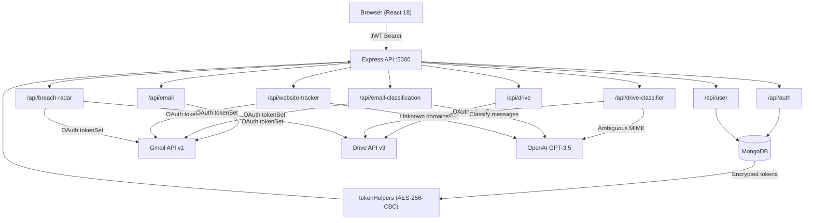

# FootPrintX

🚀 **Live Demo:** [https://footprintx-privacy.netlify.app/](https://footprintx-privacy.netlify.app/)

### AI-Powered Digital Hygiene & Privacy Management Platform


FootPrintX is a full-stack AI-powered platform that helps users understand, monitor, and reduce their digital footprint. It connects to Google Drive and Gmail via OAuth to scan files, classify emails, track online accounts, detect privacy risks, and generate a real-time security score — all without any third-party breach databases or paid external services. Every insight is derived from the user's own data.

---

## Table of Contents

- [Features](#features)
- [Screenshots](#screenshots)
- [Tech Stack](#tech-stack)
- [System Architecture](#system-architecture)
- [Project Structure](#project-structure)
- [Installation](#installation)
- [Environment Variables](#environment-variables)
- [Running the Project](#running-the-project)
- [API Reference](#api-reference)
- [Performance Notes](#performance-notes)
- [Future Enhancements](#future-enhancements)
- [Contributors](#contributors)
- [License](#license)

---

## Features

### Authentication & Account

| Feature | Details |
|---|---|
| Google OAuth 2.0 | Sign in with Google, scoped access to Drive and Gmail |
| JWT Authentication | Stateless authentication with 24-hour expiry |
| Secure Token Storage | Access and refresh tokens AES-256-CBC encrypted in MongoDB |
| Token Auto-Refresh | Expired tokens refreshed transparently before each API call |
| Email / Password Auth | Traditional registration and login for non-Google users |

### Dashboard

The central hub providing a real-time overview of all modules.

- Live metric cards: Email Health, Storage Status, Digital Wellness
- Module navigation grid (10 tools)
- Live Privacy & Security Radar card with alert badge sourced from the API
- Email Classification panel embedded inline
- Animated loading screen with progress indicator

### Email Subscription Manager

Scans Gmail promotions, updates, and forum categories to identify subscription-style senders.

- Detects `List-Unsubscribe` headers and one-click RFC 8058 unsubscribe support
- Extracts unsubscribe links from HTML bodies when headers are absent
- Bulk unsubscribe via mailto, direct link, or one-click POST
- Sender statistics: email count, last received date, category
- Categories: Promotions, Newsletters, Education, Forums, Social, Updates, Other

### AI Email Classification

Connects to Gmail and classifies every email in the inbox using rule-based detection with an OpenAI fallback.

- Categories: Spam, Marketing, Newsletters, Social Media, Automated, Financial, Work, Personal, Low Priority
- Confidence scores per message
- Donut chart with per-category counts and percentages
- Bulk Trash (recoverable) and permanent Delete
- Deletion verification endpoint
- Search and filter by category within the results table

### Drive Decay Detector

Analyses Google Drive metadata to surface stale and low-value files.

- Lists all non-trashed Drive files with size, modified date, last viewed date, and MD5 checksum
- ML decay scoring: age, size, access frequency, and duplicate detection
- Storage breakdown by category: Documents, Media, Archives, Folders, Other
- Duplicate file group detection via checksum matching
- Cleanup suggestions sorted by highest decay score

### Drive File Classifier

Classifies every Drive file into fine-grained categories using MIME-type rules with an OpenAI batch fallback.

- 10 categories: Documents, Images, Videos, Audio, PDFs, Presentations, Spreadsheets, Archives, Code, Others
- MIME-type fast path — OpenAI only called for ambiguous types
- Per-category file count and total storage consumption
- Storage analytics charts

### Website Tracker

Extracts the complete set of websites a user has interacted with by analysing Gmail sender domains.

- Scans up to 1500 messages across inbox, promotions, updates, forums, and sent
- Groups senders by registrable domain (handles country-code TLDs)
- Rule-based category detection for 100+ known brands across 12 categories: Shopping, Developer, Professional, Entertainment, Education, Finance, Travel, Social, Cloud, Security, Health, Other
- OpenAI fallback for unrecognised domains
- Active / Inactive status (90-day threshold)
- Email count, first seen, last seen, sample subjects, and favicon per site

### Privacy & Security Radar

Generates a real-time 0–100 security score using only data produced inside FootPrintX. No external breach APIs.

- **Public Drive Files** — files shared with `type=anyone`
- **Anyone-with-link Sharing** — files accessible via link
- **Sensitive Shared Files** — Drive Classifier categories: Identity, Financial, Government, Personal, Medical, Tax, Resume
- **Old Shared Files** — shared and not modified for more than 365 days
- **Dormant Accounts** — website accounts with no activity for more than 180 days
- **Large Shared Files** — shared files exceeding 100 MB
- **Password Reuse Risk** — inferred from total online account count (Low / Medium / High)
- Severity levels: Critical, High, Medium, Low
- Prioritised recommendations with direct navigation to the relevant module
- Alert timeline with filters: All, Critical, High, Medium, Low, Safe

### Storage Analytics

Visual breakdown of Google Drive storage usage by file category with size and count per bucket.

### Email Health

Inbox health summary powered by email classification results: spam ratio, low-priority ratio, and cleanable email count.

### Digital Wellness

Aggregated health report combining all modules into a single wellness score.

- Five dimensions: Email, Storage, Privacy, Subscriptions, Websites
- Radar chart and bar chart of dimension scores
- Personalised recommendations with priority levels
- Quick-action buttons to each relevant module

### Account & Identity (Profile)

Full Google Account-style identity dashboard.

- Google profile photo, name, email, and verified badge loaded from the DB
- Digital Identity Card with token status, auth provider, and member-since date
- Live statistics pulled from all modules: total emails, Drive files, websites tracked, security score, active alerts
- Connected Services panel: Drive, Gmail, Website Tracker, Radar — each with last-scan stats and a direct Open Module button
- Privacy Overview with three score rings
- Security tab: last login, token status, auth method, Security Radar summary
- Change Password panel (Google users see a "managed by Google" notice)
- Preferences panel: theme, language, notifications, auto cleanup, AI classification, privacy alerts

---

## Screenshots

### Dashboard
> Real-time module overview with metric cards, live Breach Radar panel, and Email Classification inline.

### Email Classification
> Donut chart with per-category breakdown, searchable email table, and bulk delete controls.

### Drive File Classifier
> AI-classified file grid with storage analytics and category counts.

### Website Tracker
> Full domain list with category badges, active/inactive status, and email frequency.

### Privacy & Security Radar
> Security score gauge, alert timeline with severity filters, and recommendations sidebar.

### Profile
> Google Account-style identity dashboard with live statistics from all modules.

---

## Tech Stack

### Frontend

| Technology | Purpose |
|---|---|
| React 18 | UI framework |
| React Router v6 | Client-side routing |
| Framer Motion | Animations and transitions |
| Tailwind CSS 3 | Utility-first styling |
| Recharts | Charts (radar, bar, pie, donut) |
| Lucide React | Icon library |

### Backend

| Technology | Purpose |
|---|---|
| Node.js 18+ | Runtime |
| Express 4 | HTTP server and routing |
| Mongoose | MongoDB ODM |
| jsonwebtoken | JWT generation and verification |
| bcryptjs | Password hashing |
| google-auth-library | OAuth2 client |
| googleapis | Drive v3 and Gmail v1 API clients |

### Database

| Technology | Purpose |
|---|---|
| MongoDB | Primary data store |
| Mongoose | Schema definition, validation, queries |

### AI

| Technology | Purpose |
|---|---|
| OpenAI GPT-3.5-turbo | Email classification, Drive file categorisation, website categorisation fallback |

### Google Services

| Service | Scopes used |
|---|---|
| Google OAuth 2.0 | `userinfo.profile`, `userinfo.email` |
| Google Drive API v3 | `drive.readonly`, `drive.metadata.readonly` |
| Gmail API v1 | `gmail.readonly`, `gmail.modify`, `gmail.send`, `gmail.settings.basic` |
| Google Contacts API | `contacts.readonly` |

---

## System Architecture



---

## Project Structure

```
FootPrintX/
├── .env
├── .env.local
├── .gitignore
├── package.json
│
├── backend/
│   ├── server.js                  # Entry point — connects DB, starts Express
│   ├── app.js                     # Route registration, middleware
│   ├── config.env
│   │
│   ├── config/
│   │   ├── db.js                  # Mongoose connection
│   │   └── googleClient.js        # OAuth2Client factory
│   │
│   ├── controllers/
│   │   ├── authController.js
│   │   ├── userController.js
│   │   ├── emailController.js
│   │   ├── emailClassificationController.js
│   │   ├── driveController.js
│   │   ├── driveClassifierController.js
│   │   ├── websiteTrackerController.js
│   │   └── breachRadarController.js
│   │
│   ├── middleware/
│   │   └── auth.js                # JWT authenticateToken middleware
│   │
│   ├── models/
│   │   ├── User.js                # User schema with encrypted OAuth tokens
│   │   └── Subscription.js
│   │
│   ├── routes/
│   │   ├── auth.js
│   │   ├── user.js
│   │   ├── admin.js
│   │   ├── email.js
│   │   ├── emailClassification.js
│   │   ├── drive.js
│   │   ├── driveClassifier.js
│   │   ├── websiteTracker.js
│   │   └── breachRadar.js
│   │
│   ├── services/
│   │   ├── breachRadar/
│   │   │   └── breachRadarService.js
│   │   ├── drive/
│   │   │   ├── driveService.js
│   │   │   ├── driveClassifierService.js
│   │   │   └── mlService.js
│   │   ├── emailClassification/
│   │   │   ├── emailFetcherService.js
│   │   │   ├── emailClassifierService.js
│   │   │   └── emailDeleterService.js
│   │   ├── gmail/
│   │   │   ├── gmailService.js
│   │   │   └── unsubscribeService.js
│   │   └── websiteTracker/
│   │       └── websiteTrackerService.js
│   │
│   └── utils/
│       ├── encryption.js          # AES-256-CBC encrypt / decrypt
│       └── tokenHelpers.js        # Store, validate, refresh OAuth tokens
│
└── frontend/
    ├── postcss.config.js
    ├── tailwind.config.js
    │
    ├── public/
    │   └── index.html
    │
    └── src/
        ├── App.js                 # Router, auth state, protected routes
        ├── index.js
        ├── index.css
        │
        ├── components/
        │   ├── Dashboard.js
        │   ├── BreachRadar.js     # Live dashboard card
        │   ├── EmailClassification.js
        │   ├── WebsiteTracker.js
        │   ├── Profile.js
        │   ├── Header.js
        │   ├── Homepage.js
        │   ├── Auth.js
        │   ├── AuthModal.js
        │   ├── GoogleAuthCallback.js
        │   ├── MetricCard.js
        │   ├── ModuleCard.js
        │   ├── Features.js
        │   ├── About.js
        │   ├── Security.js
        │   └── drive/ & email/    # Sub-component folders
        │
        ├── pages/
        │   ├── BreachRadarPage.js
        │   ├── DigitalWellness.js
        │   ├── DriveCleanup.js
        │   ├── DriveClassifier.js
        │   ├── EmailManager.js
        │   ├── EmailHealth.js
        │   ├── StorageAnalytics.js
        │   ├── DigitalRiskScore.js
        │   ├── PhotosScanner.js
        │   ├── AutoCleanup.js
        │   ├── DataLeakMonitor.js
        │   ├── AIRiskPredictor.js
        │   └── InstantLeakAlerts.js
        │
        └── services/
            └── api.js             # ApiService singleton — all fetch calls
```

---

## Installation

### Prerequisites

- Node.js 18 or higher
- MongoDB 6 or higher (local or Atlas)
- A Google Cloud project with OAuth 2.0 credentials and the Drive, Gmail, and Contacts APIs enabled
- An OpenAI API key (optional — AI features degrade gracefully without it)

### Backend

```bash
cd backend
npm install
```

### Frontend

```bash
cd frontend
npm install
```

---

## Environment Variables

### Backend — `backend/.env`

```env
PORT=5000
MONGO_URI=mongodb://localhost:27017/footprintx
JWT_SECRET=your_jwt_secret_here

GOOGLE_CLIENT_ID=your_google_client_id
GOOGLE_CLIENT_SECRET=your_google_client_secret
GOOGLE_REDIRECT_URI=http://localhost:5000/api/auth/google/callback

OPENAI_API_KEY=your_openai_api_key
OPENAI_MODEL=gpt-3.5-turbo

FRONTEND_URL=http://localhost:3009
ENCRYPTION_KEY=your_32_byte_hex_encryption_key
```

### Frontend — `frontend/.env`

```env
REACT_APP_API_URL=http://localhost:5000/api
PORT=3009
```

---

## Running the Project

### Start the backend

```bash
cd backend
node server.js
```

The API server starts at **http://localhost:5000**

### Start the frontend

```bash
cd frontend
npm start
```

The React app starts at **http://localhost:3009**

### Health check

```
GET http://localhost:5000/api/health
→ { "status": "OK", "message": "Server is running" }
```

---

## API Reference

All protected endpoints require `Authorization: Bearer <jwt>` in the request header.

### `/api/auth`

| Method | Path | Auth | Description |
|---|---|---|---|
| GET | `/google` | No | Get Google OAuth URL |
| GET | `/google/callback` | No | Google OAuth redirect handler |
| POST | `/google/callback` | No | Exchange code for token (programmatic) |
| POST | `/google/reauth` | Yes | Get re-authentication URL |
| GET | `/google/token` | Yes | Get / refresh current Google access token |
| POST | `/register` | No | Register with email and password |
| POST | `/login` | No | Login with email and password |

### `/api/user`

| Method | Path | Auth | Description |
|---|---|---|---|
| GET | `/profile` | Yes | Get full user profile from DB |
| PUT | `/profile` | Yes | Update firstName, lastName, phone |
| PUT | `/change-password` | Yes | Change password (email/password accounts) |

### `/api/email`

| Method | Path | Auth | Description |
|---|---|---|---|
| POST | `/scan` | Yes | Scan Gmail for subscription senders |
| GET | `/subscriptions` | Yes | Return cached subscription list |
| POST | `/unsubscribe` | Yes | Unsubscribe from a single sender |
| POST | `/unsubscribe/bulk` | Yes | Unsubscribe from multiple senders |

### `/api/email-classification`

| Method | Path | Auth | Description |
|---|---|---|---|
| POST | `/scan` | Yes | Classify Gmail inbox with AI |
| POST | `/trash` | Yes | Move emails to Gmail Trash |
| POST | `/delete` | Yes | Permanently delete emails |
| POST | `/verify` | Yes | Verify deletion of email IDs |

### `/api/drive`

| Method | Path | Auth | Description |
|---|---|---|---|
| GET | `/summary` | Yes | Storage usage by category |
| GET | `/files` | Yes | All files with ML decay scores |

### `/api/drive-classifier`

| Method | Path | Auth | Description |
|---|---|---|---|
| GET | `/classify` | Yes | AI-classify all Drive files |

### `/api/website-tracker`

| Method | Path | Auth | Description |
|---|---|---|---|
| GET | `/scan` | Yes | Scan Gmail for website domains |

### `/api/breach-radar`

| Method | Path | Auth | Description |
|---|---|---|---|
| GET | `/scan` | Yes | Run full Privacy & Security Radar scan |

---

## Performance Notes

- **Google OAuth** is used for all Drive and Gmail access. Users must connect their Google account before running any scan.
- **Gmail scans** (Email Manager, Website Tracker, Email Classification) fetch metadata only — no email bodies are downloaded unless needed for unsubscribe link extraction.
- **Drive scans** request metadata only via `drive.metadata.readonly` — file content is never downloaded.
- **OpenAI** is called only for ambiguous file types or unknown domains. Rule-based fast paths handle the majority of classification without any API call.
- **Large accounts**: users with 10,000+ Drive files or 50,000+ emails may experience longer scan times. Gmail API calls are concurrency-limited to avoid rate limits.
- **Breach Radar** fetches Drive permissions for up to 50 shared files per scan to stay within API quota.

---

## Future Enhancements

The following features are planned but not yet implemented:

| Feature | Description |
|---|---|
| AI Risk Predictor | ML-based risk forecasting using historical scan data |
| Data Leak Monitor | Cross-module anomaly detection for risky sharing patterns |
| Instant Leak Alerts | Real-time webhook-triggered alerts for new sharing events |
| Scheduled Background Scans | Cron-based automatic re-scanning and score tracking over time |
| Browser Extension | Track websites visited in real time from the browser |
| Mobile Application | React Native port for iOS and Android |
| Export / Report | PDF and CSV export of scan results and privacy reports |

---

## Contributors

**Developed by Yash Mhasekar**
B.Tech Computer Science Engineering — KIT Autonomous
AI & Digital Privacy Project

---

## License

This project is licensed under the [MIT License](https://opensource.org/licenses/MIT).

```
MIT License

Copyright (c) 2024 Yash Mhasekar

Permission is hereby granted, free of charge, to any person obtaining a copy
of this software and associated documentation files (the "Software"), to deal
in the Software without restriction, including without limitation the rights
to use, copy, modify, merge, publish, distribute, sublicense, and/or sell
copies of the Software, and to permit persons to whom the Software is
furnished to do so, subject to the following conditions:

The above copyright notice and this permission notice shall be included in all
copies or substantial portions of the Software.

THE SOFTWARE IS PROVIDED "AS IS", WITHOUT WARRANTY OF ANY KIND, EXPRESS OR
IMPLIED, INCLUDING BUT NOT LIMITED TO THE WARRANTIES OF MERCHANTABILITY,
FITNESS FOR A PARTICULAR PURPOSE AND NONINFRINGEMENT. IN NO EVENT SHALL THE
AUTHORS OR COPYRIGHT HOLDERS BE LIABLE FOR ANY CLAIM, DAMAGES OR OTHER
LIABILITY, WHETHER IN AN ACTION OF CONTRACT, TORT OR OTHERWISE, ARISING FROM,
OUT OF OR IN CONNECTION WITH THE SOFTWARE OR THE USE OR OTHER DEALINGS IN THE
SOFTWARE.
```
